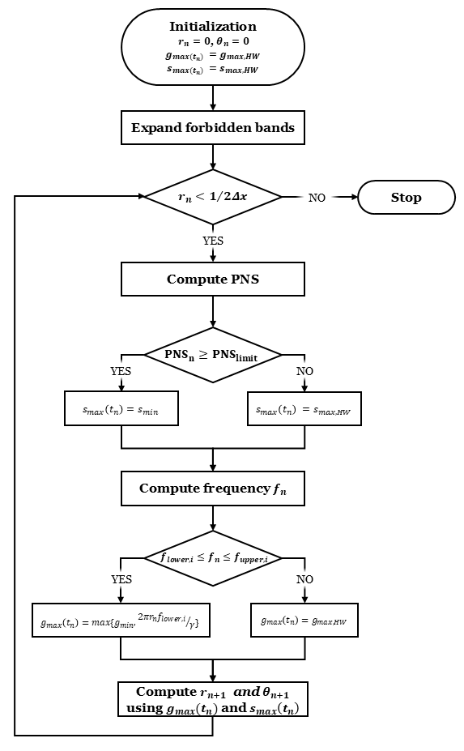

# Fast Safe Design of Spirals
This repo describes the modified algorithm for fast safe design of spirals submitted to ISMRM 2026. Firstly the original algorithm proposed by Meyer and Hargreaves is described, called here "unsafe design". Afterwards the modified fast safe design is fully derived with all expressions.

## "Unsafe" spiral design

Here k-space is described in polar coordinates:

$$k(t)=r(t)e^{i\theta(t)}=-\gamma T \sum g(t)$$

where

$\quad{}k(t)=k_x(t)+ik_y(t)$ is the complex k-space coordinates (1/cm)

$\quad{}r(t)$ is the k-space radius (1/cm)

$\quad{}\theta(t)$ is the k-space angle (radians)

$\quad{}T$ is the gradient and acquisition sampling period (s)

$\quad{}g(t)=g_x(t)+ig_y(t)$ is the complex gradient waveform (G/cm)

Deriving the previous equation we get:

$$
g(t) = -\dfrac{1}{\gamma}\dot{k}(t) = -\dfrac{1}{\gamma} \left(r_1e^{iq_0} + ir_0q_1e^{iq_0} \right)
$$

and deriving again we obtain the complex slew rate (G/cm/s):

$$
s(t) = \dot{g}(t) =-\dfrac{1}{\gamma} \left(\ddot{r}e^{i\theta} - r\dot{\theta}^2e^{i\theta} + i(2\dot{r}\dot{\theta}e^{i\theta} + r\ddot{\theta}e^{i\theta}  ) \right)
$$

Nyquist sampling limits add a constraint between $r$ and $\theta$:

$$
\dfrac{dr}{d\theta}=\dfrac{N}{2\pi F} 
$$

which results in

$$
\dot{\theta} = \dfrac{2\pi F}{N} r_1 
$$

$$
\ddot{\theta} = \dfrac{2\pi \frac{dF}{dr}}{N} r_1^2 + \dfrac{2\pi F}{N} r_2 
$$

The two equations above can be used to rewrite expressions for $g(t)$ and $s(t)$ solely as a function of $\dot{r}$ and $\ddot{r}$.

Then given some initial conditions ($r(t=0)=0$, $\theta(t=0)=0$, $\dot{r}(t=0)=0$, $\dot{\theta}(t=0)=0$), the spiral is designed using a time-marching approach by checking at each time-step if the spiral is gradient- or slew-limited. This is done by checking is the current gradient amplitude exceeds the maximum:

$$
|g(t)| = g_{max} \Leftrightarrow 
$$

$$
\Leftrightarrow \left|-\dfrac{1}{\gamma} \left(\dot{r}e^{i\theta} + ir\dot{\theta}e^{i\theta} \right)\right| = g_{max}
$$

$$
\Leftrightarrow \left|\dot{r} + ir \frac{2\pi{}F}{N}\dot{r}\right| = \gamma g_{max}
$$

$$
\Rightarrow \dot{r}_{max}^2 +\left(r \frac{2\pi{}F}{N}\dot{r}_{max}\right)^2 = (\gamma g_{max})^2
$$

$$
\Rightarrow \dot{r}_{max} = \sqrt{ \dfrac{ (\gamma g_{max})^2 }{  \left(1+r \frac{2\pi{}F}{N} \right)^2 } }
$$

If $\dot{r}>\dot{r} _{max}$ then it is gradient amplitude limited and $\ddot{r}=(\dot{r} _{max}-\dot{r})/T$. If not then it’s slew rate limited:

$$
|s(t)| =s_{max}
$$

$$
\left| \ddot{r}e^{i\theta} - r\dot{\theta}^2e^{i\theta} + i(2\dot{r}\dot{\theta}e^{i\theta} + r\ddot{\theta}e^{i\theta}  )  \right| = \gamma s_{max} 
$$

$$
\left| \ddot{r} - r\dot{\theta}^2 + i(2\dot{r}\dot{\theta} + r\ddot{q}  )  \right| = \gamma s_{max}  
$$

$$
\left| \ddot{r} - r c^2 \dot{r}^2 + i(2\dot{r}^2c + r (\dfrac{2\pi \frac{dF}{dr}}{N} \dot{r}^2 + c\,{} \ddot{r} ))  \right| = \gamma s_{max}    \\
$$

$$
\left( \ddot{r} - c^2 r  \dot{r}^2 \right)^2 +  \left( 2\dot{r}^2c +  \dfrac{2\pi \frac{dF}{dr}}{N} \dot{r}^2 r + c\,{} \ddot{r}r  \right)^2 = (\gamma s_{max})^2 $$

$$
\ddot{r}^2 + (c^2r  \dot{r})^2 - 2c^2r  \dot{r}^2\ddot{r}  +  4c^2\dot{r}^4 + 4c\dfrac{2\pi \frac{dF}{dr}}{N}r\dot{r}^4 + (\dfrac{2\pi \frac{dF}{dr}}{N})^2 \dot{r}^4 r^2  + 4c^2r\dot{r}^2\ddot{r}  + 2c\dfrac{2\pi \frac{dF}{dr}}{N}r^2\dot{r}^2\ddot{r} + c^2r^2\ddot{r}^2  = (\gamma s_{max})^2    
$$

$$
\equiv A\ddot{r}^2 + B\dot{r} + C = 0    
$$

After determining $\ddot{r}$ (gradient or slew rate limited case), $\ddot{\theta}$ is obtained via the second derivative of the Nyquist sampling limit (se above), and with both $\ddot{r}$ and $\ddot{\theta}$ Euler’s method is used to find the next iteration point:

$$
\dot{r}(t_{n+1}) = \dot{r}(t_n) + \ddot{r}(t_n+1)T 
$$

$$
r(t_{n+1}) = r(t_n)+\dot{r}(t_{n+1})T 
$$

$$
\dot{\theta}(t_{n+1}) = \dot{\theta}(t_n) + \ddot{\theta}(t_n+1)T 
$$

$$
\theta(t_{n+1}) = \theta(t_n)+\dot{\theta}(t_{n+1})T
$$

And from these we can calculate the current k-space and gradients.

## Fast Safe Design

The modified algorithm is described in the flowchart:

  
 
 <em>Figure 1. Flowchart of the proposed algorithm.</em> 

### PNS
At every iteration the PNS is computed recursively and if it exceeds the user defined limit $PNS_{limit}$ then the slew rate is reduced to $s_{min}$. This value is the lowest possible slew such that Nyquist sampling limit is not violated. To calculate this, the quadratic equation needs to have a positive discriminant:

$$ 
B^2 - 4AC \geq 0
$$

where $A$, $B$ and $C$ are described as above. We solve this equation with respect to the slew rate, which is now defined $s_{min}$ rather than $s_{max}$ as before:

$$
s_{min} = \dfrac{1}{\gamma} \sqrt{ \dfrac{C^\prime - B^2}{4A} }
$$

where $C^\prime = C + (\gamma s_{max})^2$.

### Mechanical resonances

To design safe spirals for mechanical resonances we follow the same approach proposed by McCready et al (ISMRM 2024). The "instantenous" frequency of the spiral is calculated:

$$
f_{spiral}(t_n) = \dfrac{\gamma{}\|g\|}{2\pi{}r(t_n)}
$$

whenever $f_{spiral}$ reaches the upper frequency of a forbidden band, the gradient amplitude is brought down to $\dfrac{2\pi{}r(t_n)f_{lower}}{\gamma}$ where $f_{lower}$ is the lower frequency of the forbidden band. This forces the spiral frequency to jump across the band.

In the proposed algorithm the gradient amplitude cannot be immediately reduced to that amplitude without violating the slew rate. So at each time-step the gradient amplitude is brought down to the largest value between $\dfrac{2\pi{}r(t_n)f_{lower}}{\gamma}$ and $g_{min}$. 

$g_{min}$ is the lowest possible gradient amplitude that can be used without violating the slew rate and is calculated as follows. 

At $n^{th}$ iteration the gradient amplitude is:

$$|g(t_n)|=\dfrac{\dot{r}(t_n)}{\gamma}\sqrt{1+\left(\dfrac{2\pi{}F(t_n)r(t_n)}{N}\right)^2}$$

At the next iteration we have 

$$
\dot{r}(t_{n+1}) = \dot{r}(t_n)+\ddot{r}(t_n)T
$$

$$
r(t_{n+1}) = r(t_n)+\dot{r}(t_n)T
$$ 

For the gradient amplitude:

$$
|g(t_{n+1})|=\dfrac{\cdot{r}(t_{n+1})}{\gamma}\sqrt{1+\left(\dfrac{2\pi{}F(t_{n+1})r(t_{n+1})}{N}\right)^2}
$$

Replacing the previous equation and assuming $F(t_{n+1})\approx{}F(t_n)$

$$
|g(t_{n+1})|=\dfrac{\dot{r}(n)+\ddot{r}(t_n)T}{\gamma}\sqrt{1+\left(\dfrac{2\pi{}F(t_n)\left(r(t_n)+\dot{r}(t_n)T+\ddot{r}(t_n)T^2\right)}{N}\right)^2}
$$

where $\ddot{r}$ is determined by solving the quadratic equation as slew is assumed to be the limiting factor.
**Note that the quadratic equation solved to find $\ddot{r}$$ returns two solutions. The smallest corresponds to a decrease in radial velocity and therefore gradient amplitude and is the one that should be used here:**

$$
g_{min} = \dfrac{\dot{r}+\ddot{r}T}{\gamma}\sqrt{1+\left(\dfrac{2\pi{}F\left(r+\dot{r}T+\ddot{r}T^2\right)}{N}\right)^2}
$$

